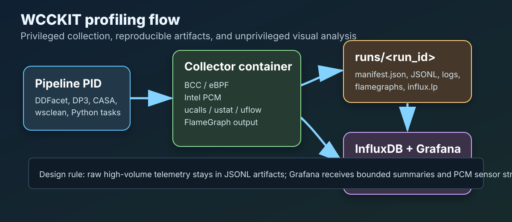
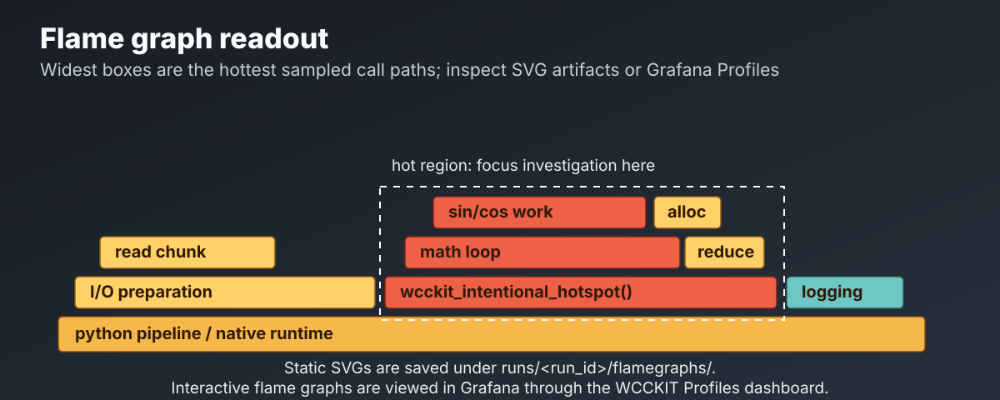
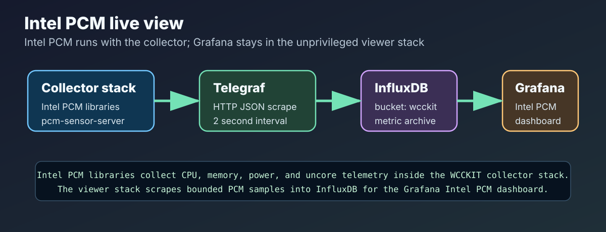

# WCCKIT

[](https://github.com/razman786/wcckit/actions/workflows/ci.yml)

Copyright (c) 2026, Raz.
Licensed under the GNU General Public License v2.0. See [`LICENSE`](LICENSE).

WCCKIT is the Workload Characterisation and Capacity Kit: a practical toolkit for
profiling and characterising radio-astronomy and astrophysics processing
workloads on Linux systems.

It follows the direction of the Workload Characterisation Framework from the
SKA Telescope Local Monitoring and Control Design: reproducible measurement, provenance capture, operating-system profiling, runtime resource utilisation, bottleneck location, and comparison across software and hardware versions.



## 🔭 What This Repository Contains

- `opti_disk/`: disk and CPU tuning helpers for radio-astronomy style processing
  pipelines. This is a focused subset of WCCKIT for investigating disk speed,
  efficiency, and relevant system settings.
- `dockerfiles/`: reproducible Ubuntu 24.04 profiler images.
- `examples/profiling/`: small validation workloads for checking that profiling
  works before pointing WCCKIT at a real pipeline.

Some scripts can touch low-level system state. Use dry-run modes first, check the
planned target device carefully, and do not run destructive storage commands
against real hardware unless you have verified the target.

## 🚀 Quick Start: Split Viewer And Collector Deployment

Clone the repository on each machine that will take part in profiling:

```bash
git clone https://github.com/razman786/wcckit.git
cd wcckit
```

WCCKIT is designed to split the deployment:

```text
researcher laptop/desktop:  viewer only, unprivileged Grafana + InfluxDB + Pyroscope
compute node/server:        collector only, privileged BCC/perf/hardware-counter container
```

This keeps the heavy, privileged collector off the laptop and keeps the Grafana
stack off the compute node. The same Git checkout can be used on both machines;
you build only the role needed on each host.

### Laptop/Desktop: Build The Viewer Role

On the researcher laptop or desktop, install Docker support for the viewer stack
without building the collector images:

```bash
dockerfiles/bin/install-wcckit-profiler-ubuntu2404.sh --viewer-only
```

Then start the local viewer:

```bash
dockerfiles/bin/run-wcckit-viewer.sh up
```

Open Grafana locally:

```text
http://localhost:3000
username: admin
password: wcckit
```

The viewer exposes local services for the collector to write to:

```text
InfluxDB:  http://localhost:8086
Pyroscope: http://localhost:4040
```

For compute-node use, keep the viewer local and use the SSH tunnel section below
so the collector can write to the laptop through `127.0.0.1` on the compute node.

### Compute Node/Server: Build The Collector Role

On the compute node or profiling server, build only the collector images:

```bash
dockerfiles/bin/install-wcckit-profiler-ubuntu2404.sh --collector-only
```

For normal mixed Intel/AMD WCCKIT pipeline servers, the collector build includes
AMD uProf by default so the same image can run on AMD hosts. First download
`amduprof_5.3-518_amd64.deb` from the AMD uProf download page
(<https://www.amd.com/en/developer/uprof.html>) in a browser, accepting AMD's
EULA, and place it in the repository root:

```text
wcckit/amduprof_5.3-518_amd64.deb
```

Then run the collector-role build. By initiating the AMD-enabled Docker build,
the user/build operator is instructing WCCKIT to install AMD uProf under AMD's
EULA. WCCKIT extracts the `.deb` payload into the image rather than running
AMD's package post-install script, because Docker builds cannot safely configure
host kernel drivers, headers, debugfs, or tracefs. WCCKIT does not commit or
redistribute AMD's `.deb` package in git; local AMD uProf packages are ignored.

For Intel-only nodes, CI-style builds, or a first validation pass where AMD uProf
is not needed, build the collector without AMD uProf:

```bash
dockerfiles/bin/install-wcckit-profiler-ubuntu2404.sh --collector-only --no-amd-uprof
```

The collector-role build creates:

- `wcckit/ubuntu-profiling-base:24.04`
- `wcckit/bcc-profiler:24.04`
- `wcckit/pipeline-profiler:24.04`

### Docker Access Notes

If Docker was just installed and your user cannot access it yet:

```bash
sudo usermod -aG docker "$USER"
newgrp docker
```

Then rerun the installer without reinstalling packages:

```bash
# laptop/desktop
dockerfiles/bin/install-wcckit-profiler-ubuntu2404.sh --viewer-only --no-apt

# compute node
dockerfiles/bin/install-wcckit-profiler-ubuntu2404.sh --collector-only --no-apt
```

If apt reports `containerd.io : Conflicts: containerd`, the host has mixed Docker
package sources. Do not install Ubuntu `docker.io` and Docker CE `containerd.io`
together. Either keep the existing Docker CE install and rerun WCCKIT with
`--no-apt`, or choose one packaging family explicitly:

```bash
# Ubuntu docker.io path
sudo apt-get remove docker-ce docker-ce-cli containerd.io docker-buildx-plugin docker-compose-plugin
sudo apt-get install docker.io docker-compose-v2 git ca-certificates curl

# Docker CE path
sudo apt-get remove docker.io containerd runc
sudo apt-get install docker-ce docker-ce-cli containerd.io docker-buildx-plugin docker-compose-plugin
```

## 🔥 Profile A Pipeline PID

Find the host process ID for the pipeline step you want to profile:

```bash
pgrep -af python
pgrep -af DDFacet
pgrep -af wsclean
pgrep -af DP3
pgrep -af casa
pgrep -af singularity
pgrep -af '<My Pipeline>'
```

Create an output directory and generate a CPU flame graph:

```bash
mkdir -p profile-output

dockerfiles/bin/run-wcckit-profiler.sh --out ./profile-output -- \
  wcckit_profile_cpu.sh \
    --pid 1234 \
    --duration 15 \
    --frequency 99 \
    --output /out/perf.svg
```

The SVG appears on the host at:

```text
./profile-output/perf.svg
```

Open it in a browser and inspect the widest frames first.



For disk fio runs under `opti_disk/`, use `--target-dir` when the mounted test
filesystem cannot be inferred unambiguously from the selected NVMe device.

## 🧪 Validate With A Python Hotspot

Before profiling a real pipeline, run the synthetic Python workload. It repeatedly
calls one intentionally expensive function and records the exact source line used
as the hotspot.

```bash
examples/profiling/profile_python_hotspot.sh
```

This writes:

```text
profile-output/python-hotspot.svg
profile-output/python-hotspot.log
```

The log includes the target PID and source-line anchor:

```text
PID=12345
HOTSPOT=/path/to/wcckit/examples/profiling/python_hotspot.py:37
HOTSPOT_FUNCTION=wcckit_intentional_hotspot
```

The SVG subtitle also records the `HOTSPOT=` line. Depending on Python/perf-map
support on the host, the flame graph may show `wcckit_intentional_hotspot`
directly, or it may show native CPython and math frames such as
`_PyEval_EvalFrameDefault`, `math_sin`, and `math_cos`. In both cases, the log
and subtitle identify the source line being exercised.

Manual version:

```bash
python3 -X perf examples/profiling/python_hotspot.py --duration 120
```

Then profile the printed PID from another terminal:

```bash
dockerfiles/bin/run-wcckit-profiler.sh --out ./profile-output -- \
  wcckit_profile_cpu.sh \
    --pid <PID> \
    --duration 15 \
    --frequency 99 \
    --output /out/python-hotspot.svg \
    --subtitle "Target hotspot: <HOTSPOT_FROM_LOG>"
```

## 🧰 Useful Examples

Profile a Python-based calibration or reduction task for 30 seconds:

```bash
PID=$(pgrep -n -f python)
dockerfiles/bin/run-wcckit-profiler.sh --out ./profile-output -- \
  wcckit_profile_cpu.sh --pid "$PID" --duration 30 --output /out/python-cpu.svg
```

Profile a `wsclean` process:

```bash
PID=$(pgrep -n -f wsclean)
dockerfiles/bin/run-wcckit-profiler.sh --out ./profile-output -- \
  wcckit_profile_cpu.sh --pid "$PID" --duration 20 --frequency 99 --output /out/wsclean-cpu.svg
```

Start an interactive profiler shell:

```bash
dockerfiles/bin/run-wcckit-profiler.sh --out ./profile-output
cat /opt/wcckit/bcc-tools-summary.txt
```

Run BCC tools directly:

```bash
dockerfiles/bin/run-wcckit-profiler.sh -- biolatency-bpfcc
dockerfiles/bin/run-wcckit-profiler.sh -- runqlat-bpfcc
```

Useful packaged BCC command names include:

```text
biolatency-bpfcc
biosnoop-bpfcc
opensnoop-bpfcc
runqlat-bpfcc
profile-bpfcc
execsnoop-bpfcc
```

## 📊 Pipeline Profiling With BCC + Hardware Counters + InfluxDB/Grafana

The first combined pipeline-profiler round uses one privileged collector image
and one separate viewer/backend stack:

```text
wcckit/pipeline-profiler:24.04                 BCC/eBPF + Intel PCM + AMD uProf + app/runtime tools
InfluxDB + Grafana + Pyroscope Compose stack   unprivileged local analysis UI
```

InfluxDB is the first metrics backend because radio-astronomy pipeline telemetry
can be dense, irregular, and phase-specific. Grafana reads metrics from
InfluxDB, and reads interactive flame graphs from Pyroscope. WCCKIT still writes
raw artifacts to disk so a run can be inspected, reprocessed, and compared
later. Grafana is a view, not the source of truth.

The collector aligns three layers of behaviour:

```text
PCM                 hardware/socket/core/memory/PCIe telemetry
BCC/eBPF            kernel, I/O, scheduler, syscall, and flamegraph telemetry
ucalls/ustat/uflow  application/runtime alignment for languages such as Python
```

For real compute-node work, the recommended default is the reverse SSH tunnel
workflow below: keep Grafana/InfluxDB/Pyroscope on the researcher laptop or
desktop, and run only the privileged collector on the compute node. For a
single-machine test, start the local InfluxDB + Grafana stack and then run the
Pipeline Overview collector against the target PID.

On the laptop or desktop:

```bash
dockerfiles/bin/run-wcckit-viewer.sh up
```

Open a browser at `http://localhost:3000` and log in with:

```text
username: admin
password: wcckit
```

The viewer defaults are:

```text
Grafana:   http://localhost:3000
InfluxDB:  http://localhost:8086
Pyroscope: http://localhost:4040
Org:       wcckit
Bucket:    wcckit
Token:     wcckit-dev-token
```



On the machine where the pipeline is running, start the pipeline first, then
attach WCCKIT to the newest matching process. This is normally what an
astrophysics user wants when a pipeline stage is already running:

```bash
dockerfiles/bin/run-wcckit-pipeline-overview.sh \
  --match DDFacet \
  --pipeline DDFacet \
  --language python
```

Equivalent explicit PID version:

```bash
PID=$(pgrep -n -f DDFacet)

dockerfiles/bin/run-wcckit-pipeline-overview.sh \
  --pid "$PID" \
  --pipeline DDFacet \
  --language python
```

By default this writes to `runs/<run_id>/`, uses `--hardware-counters auto`,
streams bounded metrics to the local viewer at `http://127.0.0.1:8086`, and uses
a 24-hour safety cap while waiting for the PID to exit. Use `--max-duration` to
set a shorter cap.

Sampled CPU flame graphs are off by default in the Pipeline Overview wrapper to
keep the first dashboard run lighter. Add `--flamegraph` when you also want CPU
folded stacks and `flamegraphs/cpu.svg`; add `--pyroscope-url` and
`--push-profiles` when the viewer should receive interactive profile data:

```bash
dockerfiles/bin/run-wcckit-pipeline-overview.sh \
  --match DDFacet \
  --pipeline DDFacet \
  --language python \
  --flamegraph \
  --pyroscope-url http://127.0.0.1:4040 \
  --push-profiles
```

For fixed-duration collection instead of “until the PID exits”, use the
lower-level `run-wcckit-pipeline-profiler.sh` wrapper with `--duration SECONDS`.

The viewer provisions four dashboards:

```text
WCCKIT Pipeline Overview
WCCKIT Profiles
Intel® Performance Counter Monitor (Intel® PCM) Dashboard
AMD uProf / AMDuProfPcm Dashboard
```

### Default: Profiling From A Compute Node Over SSH

Most production radio-astronomy pipelines will run on a compute node reached over
SSH, while Grafana runs on the researcher’s laptop or desktop:

```text
laptop/desktop: runs Grafana + InfluxDB + Pyroscope viewer stack
compute node:   runs the privileged WCCKIT collector beside the pipeline PID
```

Example network placeholders:

```text
desktop/laptop viewer: <laptop-or-desktop-ip>
compute node collector: <compute-node-ip>
```

On the laptop or desktop:

```bash
cd /path/to/wcckit
dockerfiles/bin/run-wcckit-viewer.sh up
dockerfiles/bin/run-wcckit-ssh-tunnel.sh <compute-node-user>@<compute-node-ip>
```

Leave the tunnel terminal open. It exposes the laptop viewer on compute-node
loopback ports:

```text
InfluxDB:  http://127.0.0.1:18086
Pyroscope: http://127.0.0.1:14040
```

For an Intel compute node where the Intel PCM dashboard should scrape
`pcm-sensor-server` without exposing a network port, start the tunnel with the
optional PCM sensor forward:

```bash
dockerfiles/bin/run-wcckit-ssh-tunnel.sh --pcm-sensor <compute-node-user>@<compute-node-ip>
```

That keeps the viewer path tunnel-based in both directions: collector metrics
push back to the laptop over reverse forwards, and Grafana's PCM bridge reads
the compute-node PCM sensor through a local SSH forward.

Open Grafana on the laptop or desktop:

```text
http://localhost:3000
username: admin
password: wcckit
```

In a separate SSH session on the compute node:

```bash
ssh <compute-node-user>@<compute-node-ip>
cd /path/to/wcckit
```

Check that the tunnel is visible from the compute node:

```bash
curl http://127.0.0.1:18086/health
curl http://127.0.0.1:14040/ready
```

Or run the WCCKIT connection debugger on the compute node:

```bash
dockerfiles/bin/run-wcckit-debug-connection.sh \
  --role collector \
  --influx-url http://127.0.0.1:18086 \
  --pyroscope-url http://127.0.0.1:14040 \
  --pcm-url http://127.0.0.1:9738/persecond/
```

The debugger is read-only. It checks the reverse SSH tunnel endpoints, the local
Intel `pcm-sensor-server` endpoint, the required PCM `Accept` headers, and the
latest WCCKIT PCM logs if they exist. If InfluxDB and Pyroscope pass but PCM
fails, the tunnel is working and the remaining problem is the Intel PCM server or
its permissions/support on the compute node.

On the laptop or desktop, the same helper checks the viewer containers and the
Telegraf PCM scrape path:

```bash
dockerfiles/bin/run-wcckit-debug-connection.sh \
  --role viewer \
  --pcm-url http://127.0.0.1:9738/persecond/ \
  --show-logs
```

If the laptop PCM forward works but Telegraf cannot reach
`host.docker.internal`, restart the viewer with a site-appropriate URL, for
example `WCCKIT_PCM_SENSOR_URL=http://<laptop-or-desktop-ip>:9738/persecond/`.

Start the pipeline in the normal site-approved way, or attach to a pipeline that
is already running. For example:

```bash
pgrep -af DDFacet

PID=$(pgrep -n -f DDFacet)

dockerfiles/bin/run-wcckit-pipeline-overview.sh \
  --pid "$PID" \
  --pipeline DDFacet \
  --language python \
  --hardware-counters none \
  --influx-url http://127.0.0.1:18086
```

`--hardware-counters none` is the recommended first run while hardware-counter
backends are being validated on a new node. It keeps the first dashboard useful
by collecting application runtime summaries, process memory footprint, BPF I/O
summaries, run markers, and collector status without attempting Intel PCM or AMD
uProf. Replace it with `--hardware-counters intel-pcm`, `--hardware-counters
amd-uprof`, or `--hardware-counters auto` once the relevant hardware-counter
backend is working on the node.

To include sampled CPU flame graph artifacts and interactive profile upload, add
`--flamegraph`, the tunneled Pyroscope URL, and `--push-profiles`:

```bash
dockerfiles/bin/run-wcckit-pipeline-overview.sh \
  --match DDFacet \
  --pipeline DDFacet \
  --language python \
  --hardware-counters none \
  --influx-url http://127.0.0.1:18086 \
  --pyroscope-url http://127.0.0.1:14040 \
  --flamegraph \
  --push-profiles
```

The collector writes raw artifacts on the compute node under `runs/<run_id>/` and
streams bounded dashboard metrics through the SSH tunnel to the laptop viewer.
On the laptop, open `http://localhost:3000`, log in as `admin` / `wcckit`, and
start with `WCCKIT Pipeline Overview`.

If reverse SSH tunnelling is not available and the desktop firewall allows direct
connections from `<compute-node-ip>`, the compute node can send directly to the desktop
viewer instead:

```bash
curl http://<laptop-or-desktop-ip>:8086/health
curl http://<laptop-or-desktop-ip>:4040/ready

dockerfiles/bin/run-wcckit-pipeline-overview.sh \
  --pid "$PID" \
  --pipeline DDFacet \
  --language python \
  --hardware-counters none \
  --influx-url http://<laptop-or-desktop-ip>:8086 \
  --pyroscope-url http://<laptop-or-desktop-ip>:4040 \
  --push-profiles
```

Prefer the reverse SSH tunnel unless the site explicitly allows the desktop
viewer services to be reachable from the compute network. If the compute node
cannot accept reverse SSH forwards, ask the site administrator whether
`AllowTcpForwarding` is enabled for your login node or use the site’s approved
SSH jump-host pattern.

The run marker panel plots each run as a start point and an end point on the
time axis, joined by a thin horizontal line. The y-axis is a pipeline/job lane
counter, not duration. Use `--job-lane N` when launching multiple simultaneous
pipeline jobs so concurrent runs can be stacked as lanes 1, 2, 3, and so on.

The `WCCKIT Pipeline Overview` dashboard is the first dashboard to open after a
run. It shows run markers, collector status, bounded BPF summaries, application
runtime summaries, process memory footprint, hardware-counter activity, and
WCCKIT-owned line protocol. The BPF I/O panel is fed from `biolatency-bpfcc -j`
summary samples because this produces bounded, low-cardinality block-I/O
telemetry that is suitable for InfluxDB. Raw per-I/O event streams, for example
from `biosnoop`, should stay as JSONL artifacts or be exported only as bounded
summaries.

The memory footprint panel is per target PID and comes from procfs
(`rss_bytes`, `vms_bytes`, `data_bytes`, `swap_bytes`, and page-fault rates).
It is deliberately separate from hardware memory-bandwidth or roofline data.
Hardware memory and power counters belong in the AMD uProf or Intel PCM detail
views when the relevant backend supports them. The application-runtime panel
uses language runtime summaries when BCC can attach to the target runtime; when
Python USDT probes are unavailable, WCCKIT also records a bounded per-PID syscall
summary so the panel still shows useful runtime activity and marks the
language-level probes unavailable.

For AMD systems, WCCKIT also supports AMD uProf Classic Roofline collection as a
launch-mode workflow. Roofline is not an attach-to-PID time-series collector; it
wraps and launches the workload so AMD uProf can generate its HTML roofline
report. Use this when you want to understand whether a pipeline stage is closer
to a memory-bandwidth ceiling or a compute ceiling:

```bash
dockerfiles/bin/run-wcckit-amd-roofline.sh \
  --pipeline DDFacet \
  --run-id ddfacet-roofline-001 \
  --out runs/ddfacet-roofline-001 \
  --influx-url http://127.0.0.1:8086 \
  --influx-org wcckit \
  --influx-bucket wcckit \
  --influx-token wcckit-dev-token \
  -- DDFacet <pipeline args>
```

On Zen 4 and later systems where the kernel cannot access data-fabric counters,
AMD documents `--msr` as the privileged fallback:

```bash
dockerfiles/bin/run-wcckit-amd-roofline.sh \
  --pipeline DDFacet \
  --run-id ddfacet-roofline-msr-001 \
  --msr \
  --read-smbios \
  --out runs/ddfacet-roofline-msr-001 \
  -- DDFacet <pipeline args>
```

The AMD-generated report remains the authoritative artifact under:

```text
runs/<run_id>/roofline/amd-uprof/
```

The overview dashboard records only bounded roofline status and artifact counts
in InfluxDB. Do not push full roofline reports or arbitrary command lines into
Influx tags. AMD's PDF modelling path using `AMDuProfModelling.py` is documented
by AMD as deprecated; WCCKIT keeps the HTML roofline report as the first-class
artifact for this first integration.

### Interactive Flame Graphs In Grafana

Grafana uses Pyroscope for interactive profile views. InfluxDB remains the place
for metrics, summaries, collector status, and run markers. The reproducible run
record stays on disk as JSONL, folded stacks, SVGs, logs, and the manifest.

CPU flame graphs are sampled profiles. WCCKIT preserves every collected folded
stack line in `profiles/cpu.folded` and also writes the static SVG to
`flamegraphs/cpu.svg`, but this is sampled CPU time rather than a complete list
of every function call. Function names, line numbers, and source-code links
depend on what the target runtime and binaries expose to the profiler. For
Python targets, starting the pipeline with `python3 -X perf` usually improves
stack naming where the Python/runtime/kernel combination supports it. Native
code needs usable symbols/debug information and profiler-friendly frame
unwinding.

`uflow` is different: it is a call-flow event stream. When `--app-flow-raw` is
enabled, WCCKIT preserves the exact BCC output in `events/app-uflow.raw.log` and
writes every parsed or unparsed non-empty line to `events/app-uflow.jsonl`. It
derives `profiles/app-uflow.folded` as an entry-event call tree for the
interactive Pyroscope/Grafana flame graph. WCCKIT converts folded stacks to a
minimal pprof payload before pushing to Pyroscope, using a sample-count profile
shape and labelling uflow as `profile_type=uflow`; read it as event counts, not
CPU time. Return events are still preserved in JSONL and counted in summary
metrics, but they are not counted as flame-graph samples because they represent
stack close events, not additional CPU work. A line that the parser cannot
understand is still written as a `raw_unparsed` JSONL record; it is not silently
dropped.

Use this workflow for interactive CPU and application-flow flame graphs:

```bash
dockerfiles/bin/run-wcckit-viewer.sh up

PID=$(pgrep -n -f DDFacet)

dockerfiles/bin/run-wcckit-pipeline-profiler.sh \
  --pid "$PID" \
  --duration 120 \
  --pipeline DDFacet \
  --language python \
  --hardware-counters auto \
  --job-lane 1 \
  --app-flow-raw \
  --pyroscope-url http://127.0.0.1:4040 \
  --push-profiles \
  --run-id ddfacet-profile-001 \
  --out runs/ddfacet-profile-001 \
  --influx-url http://127.0.0.1:8086 \
  --influx-org wcckit \
  --influx-bucket wcckit \
  --influx-token wcckit-dev-token
```

Open Grafana at `http://localhost:3000` and use the `WCCKIT Profiles` dashboard.
Pyroscope is also available directly at `http://localhost:4040` for profile
inspection. The CPU panel is a sampled flame graph; the uflow panel is an
entry-event call tree. If method names look vague, first check the raw folded
files under `profiles/` and then improve runtime symbol support rather than
assuming the profiler lost the data.

Raw `uflow` can be very high volume and can perturb runtime. Keep it deliberate
and bounded by duration. Method names and stacks are kept out of InfluxDB tags to
avoid cardinality explosion; Influx receives only summary counts and status.

### Hardware Counter Backends

The viewer stack is shared. One Grafana instance can show WCCKIT Pipeline
Overview data plus the Intel PCM and AMD uProf dashboards, even when different
compute nodes use different CPU vendors. The collector decides what to emit for
each run; the viewer simply displays whatever measurements arrive in InfluxDB.

Use `--hardware-counters none` for the first validation run on a new node. This
keeps the Pipeline Overview dashboard populated with runtime, memory footprint,
BPF I/O, run markers, and collector status while avoiding hardware-counter setup
problems. Once a backend is working, enable it explicitly:

```bash
--hardware-counters intel-pcm
--hardware-counters amd-uprof
--hardware-counters auto
```

`--hardware-counters auto` chooses Intel PCM on `GenuineIntel` CPUs and AMD
uProf / `AMDuProfPcm` on `AuthenticAMD` CPUs. Hardware counters are generally
system, core, socket, package, or memory-controller observations and may not be
strictly per-PID. BCC and perf remain better for PID attribution.

#### Intel PCM Backend

Intel PCM is the Intel CPU backend. Use it on Intel hosts after confirming that
`pcm-sensor-server` works on the profiled node. The WCCKIT viewer provisions the
Intel PCM dashboard by default, so the same laptop viewer can receive Intel data
from an Intel compute node and AMD data from an AMD compute node.

For a first Intel compute-node run while the Intel hardware activity path is
being debugged, keep counters disabled:

```bash
dockerfiles/bin/run-wcckit-pipeline-overview.sh \
  --pid "$PID" \
  --pipeline DDFacet \
  --language python \
  --hardware-counters none \
  --influx-url http://127.0.0.1:18086
```

When Intel PCM is working, switch the backend on explicitly:

```bash
dockerfiles/bin/run-wcckit-pipeline-overview.sh \
  --pid "$PID" \
  --pipeline DDFacet \
  --language python \
  --hardware-counters intel-pcm \
  --influx-url http://127.0.0.1:18086
```

The Intel PCM detail dashboard follows Intel's `scripts/grafana` pattern:
`pcm-sensor-server` exposes data on the profiled host and the viewer-side
Telegraf bridge writes it into InfluxDB. If PCM is unavailable or unsupported,
WCCKIT records collector status rather than silently pretending the panel has
valid data.

By default the viewer-side PCM bridge looks for a local Intel PCM sensor at:

```text
http://host.docker.internal:9738/persecond/
```

For an Intel compute node, prefer SSH forwarding or a site-approved reachable
sensor URL rather than exposing the sensor broadly. With the default PCM forward,
run the tunnel from the laptop as:

```bash
dockerfiles/bin/run-wcckit-ssh-tunnel.sh --pcm-sensor <compute-node-user>@<compute-node-ip>
```

The viewer's default `WCCKIT_PCM_SENSOR_URL` already points at
`http://host.docker.internal:9738/persecond/`, which maps to that forwarded
laptop port from inside the Grafana/Telegraf Docker network. If your site uses a
different PCM sensor address, start the viewer with an explicit endpoint:

```bash
WCCKIT_PCM_SENSOR_URL=http://target-host:9738/persecond/ \
  dockerfiles/bin/run-wcckit-viewer.sh up
```

#### AMD uProf Backend

AMD uProf / `AMDuProfPcm` is the AMD CPU backend. It is the first WCCKIT AMD
CPU-equivalent backend to Intel PCM. Omnitrace and Omniperf are useful future
integrations, especially for wrapped application tracing and ROCm/GPU profiling,
but they are not the first CPU equivalent to Intel PCM.

For operational WCCKIT pipeline servers, build the pipeline profiler image with
AMD uProf only when the AMD package is available and accepted by the build
operator. On Intel-only hosts, or while validating the Intel path, build without
AMD uProf:

```bash
dockerfiles/bin/install-wcckit-profiler-ubuntu2404.sh --no-amd-uprof
```

Equivalently for a manual Docker build:

```bash
docker build \
  -t wcckit/pipeline-profiler:24.04 \
  -f dockerfiles/profiling/pipeline/Dockerfile \
  --build-arg BASE_IMAGE=wcckit/ubuntu-profiling-base:24.04 \
  --build-arg INCLUDE_AMD_UPROF=0 \
  .
```

For mixed Intel/AMD fleets, build the pipeline profiler image with
`INCLUDE_AMD_UPROF=1` so the same collector image can run on AMD hosts. AMD's
download endpoint requires browser EULA acceptance before the `.deb` is served,
so the normal path is to download `amduprof_5.3-518_amd64.deb`, place it in the
repo root, and let the installer pass it into the Docker build. By initiating
the AMD-enabled build, the user/build operator is instructing WCCKIT to install
AMD uProf under AMD's EULA. WCCKIT extracts the `.deb` payload directly rather
than running AMD's post-install driver setup during image build. WCCKIT does not
commit or redistribute AMD's `.deb` package in this repository. CI is the
explicit exception and uses `INCLUDE_AMD_UPROF=0`. If an image was deliberately
built without AMD uProf, `--hardware-counters amd-uprof` records an unavailable
collector status rather than failing the full profiling run.

Build with a local AMD uProf `.deb`:

```bash
mkdir -p third_party
# Download amduprof_5.3-518_amd64.deb from:
# https://www.amd.com/en/developer/uprof.html
# Building with this package means you accept AMD's EULA.
cp ~/Downloads/amduprof_5.3-518_amd64.deb third_party/

docker build \
  -t wcckit/pipeline-profiler:24.04 \
  -f dockerfiles/profiling/pipeline/Dockerfile \
  --build-arg BASE_IMAGE=wcckit/ubuntu-profiling-base:24.04 \
  --build-arg INCLUDE_AMD_UPROF=1 \
  --build-arg AMD_UPROF_DEB=third_party/amduprof_5.3-518_amd64.deb \
  --build-arg AMD_UPROF_MD5=32ab052e45b8c5ffebc8bda901baef02 \
  .
```

Run an AMD uProf hardware-counter collection with:

```bash
PID=$(pgrep -n -f DDFacet)

dockerfiles/bin/run-wcckit-pipeline-overview.sh \
  --pid "$PID" \
  --pipeline DDFacet \
  --language python \
  --hardware-counters amd-uprof \
  --influx-url http://127.0.0.1:18086
```

The AMD backend runs the PID-targeted IPC collector by default. System-level
memory and power sidecar collectors are available with `--amd-uprof-memory` and
`--amd-uprof-power`; their raw CSV and JSONL artifacts remain under
`runs/<run_id>/events/` as `amd-uprof-memory.*` and `amd-uprof-power.*`.

Memory and power support are platform dependent. On some AMD CPUs,
`AMDuProfPcm -m memory` may report the memory metric as unsupported. Power
collection may require host support such as the AMD HSMP driver; when unavailable
WCCKIT records collector status and keeps the raw AMD uProf warning in the run
logs instead of pretending the metric exists. These sidecar collectors are opt-in
because concurrent PMU collection can interfere with PID-targeted IPC samples.

The host artifacts remain under the run directory:

```text
runs/ddfacet-test-001/
  manifest.json
  events/
  profiles/
  metrics/influx.lp
  flamegraphs/
  logs/
```

The collector is privileged and observes the host kernel. Use it only on systems
where this is acceptable. PCM counters are hardware/system-level and are not
strictly per-PID; BCC and perf provide stronger PID attribution. `uflow` can
produce dense method-flow traces, so raw flow capture is opt-in via
`--app-flow-raw`. By default WCCKIT exports bounded summaries to InfluxDB and
keeps raw/reproducible records on disk. Interactive profile data is pushed to
Pyroscope only from local folded artifacts after converting them to pprof for
Pyroscope's current push API; the local folded/JSONL artifacts remain
authoritative if Pyroscope is unavailable.

Reference visuals and background:

- Intel PCM command-line and Grafana screenshots: <https://github.com/intel/pcm>
- Intel PCM Grafana stack notes: <https://github.com/intel/pcm/tree/master/scripts/grafana>
- AMD uProf downloads: <https://www.amd.com/en/developer/uprof.html>
- AMD Lab Notes profilers: <https://github.com/amd/amd-lab-notes/tree/release/profilers>
- AMD uProf documentation: <https://docs.amd.com/r/en-US/57368-uProf-user-guide/uProf-User-Guide>
- Brendan Gregg's CPU flame graph examples: <https://www.brendangregg.com/FlameGraphs/cpuflamegraphs.html>

The images embedded in this README are WCCKIT-owned schematic diagrams, not
copies of the upstream screenshots.

## ⚙️ What The Docker Wrapper Does

The host launcher is:

```bash
dockerfiles/bin/run-wcckit-profiler.sh
```

It mounts your chosen output directory as `/out` and starts the BCC profiler
container with host PID visibility and the kernel tracing mounts needed for BCC.
The effective Docker run shape is:

```bash
docker run -it --rm \
  --privileged \
  --pid=host \
  --net=host \
  -v "$PWD":/out \
  -v /etc/localtime:/etc/localtime:ro \
  -v /tmp:/tmp:ro \
  -v /sys/kernel/debug:/sys/kernel/debug:rw \
  -v /sys/kernel/tracing:/sys/kernel/tracing:rw \
  -v /sys/fs/bpf:/sys/fs/bpf:rw \
  -v /sys/fs/cgroup:/sys/fs/cgroup:ro \
  -v /lib/modules:/lib/modules:ro \
  -v /usr/src:/usr/src:ro \
  wcckit/bcc-profiler:24.04
```

`--privileged` is broad, but it is the practical baseline for BCC in a container.
Use this on trusted profiling machines. For production systems, replace it with a
narrower capability/security profile only after validating the exact BCC tools
you need.

For Python targets started with `python3 -X perf`, host `/tmp` is mounted
read-only so BCC can read Python perf map files such as `/tmp/perf-<PID>.map`
when the interpreter creates them.

Do not bake `linux-headers-$(uname -r)` into the image at build time. During a
Docker build, `uname -r` reports the host kernel, which may not correspond to an
Ubuntu package available inside the image. Mount `/lib/modules` and `/usr/src` at
runtime so BCC sees the headers for the kernel it is tracing.

## 🛑 Stop The Container

Inside the container:

```bash
exit
```

or press `Ctrl+D`. If a profiling tool is running, stop it first with `Ctrl+C`.

From another terminal:

```bash
docker ps
docker stop <container_id_or_name>
```

The wrapper uses `--rm`, so the stopped container is removed automatically. The
Docker image remains installed.

## 🏗️ Advanced Manual Build

The installer script is preferred for Ubuntu 24.04 users. Advanced users can
build manually.

```bash
docker build \
  -t wcckit/ubuntu-profiling-base:24.04 \
  -f dockerfiles/base/ubuntu-24.04.4/Dockerfile \
  .

docker build \
  -t wcckit/bcc-profiler:24.04 \
  -f dockerfiles/profiling/bcc/Dockerfile \
  --build-arg BASE_IMAGE=wcckit/ubuntu-profiling-base:24.04 \
  .

docker build \
  -t wcckit/pipeline-profiler:24.04 \
  -f dockerfiles/profiling/pipeline/Dockerfile \
  --build-arg BASE_IMAGE=wcckit/ubuntu-profiling-base:24.04 \
  --build-arg INCLUDE_AMD_UPROF=1 \
  --build-arg AMD_UPROF_DEB=amduprof_5.3-518_amd64.deb \
  --build-arg AMD_UPROF_MD5=32ab052e45b8c5ffebc8bda901baef02 \
  .
```

For CI-only or deliberately Intel-only builds, override the pipeline image with
`--build-arg INCLUDE_AMD_UPROF=0`.

The base Dockerfile uses `FROM ubuntu:24.04` because Docker's official Ubuntu
images are tagged by LTS series rather than each point release. After
`apt-get update`, the userspace package set identifies as the current Ubuntu
24.04 LTS point release.

The BCC image installs Ubuntu 24.04's packaged BCC stack. The pipeline image
extends that direction with Intel PCM, AMD uProf for mixed CPU fleets, and
Python application-alignment wrappers:

```text
bpfcc-tools
python3-bpfcc
libbpfcc
libbpfcc-dev
pcm
AMDuProfPcm from AMD uProf .deb
python-is-python3
pythonflow.sh / pythoncalls.sh / pythonstat.sh
```

It also includes reference/source trees for:

```text
/src/bcc
/src/FlameGraph
```

The default BCC source checkout is pinned by `BCC_REF` in the Dockerfile rather
than following `master`, so CI and user builds are reproducible. Override the BCC
source checkout when you need a different reference revision:

```bash
docker build \
  -t wcckit/bcc-profiler:bcc-v0.35.0 \
  -f dockerfiles/profiling/bcc/Dockerfile \
  --build-arg BASE_IMAGE=wcckit/ubuntu-profiling-base:24.04 \
  --build-arg BCC_REF=v0.35.0 \
  .
```

## 🧭 Why Split The Images?

The base image holds common Linux build and profiling prerequisites, including
Ubuntu 24.04 `perf`, `cpupower`, `bpftool`, `turbostat`, and related linux-tools.
Derived images can add BCC, bpftrace, perf-only workflows, fio-specific tooling,
or radio-astronomy pipeline-specific profilers without duplicating the base
system.

That matches the WCCKIT direction: standardised, reproducible, verifiable
workload characterisation with enough provenance to compare measurements across
systems and tool selections.
