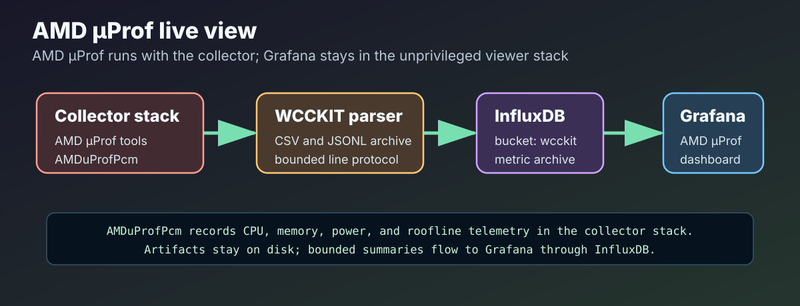

---
hide:
  - toc
---

<section class="wcckit-hero wcckit-hero--single">
  

  
Workload Characterisation and Capacity Kit

  

    WCCKIT is a Linux toolkit for profiling and characterising radio-astronomy and
    astrophysics processing pipelines. It helps a researcher attach to a running
    pipeline PID, collect CPU, memory, I/O, hardware-counter, and flamegraph telemetry,
    view the run in Grafana, and keep reproducible raw artifacts for later comparison.
  

  

    
  

  

    <a class="wcckit-button wcckit-button--primary" href="quick-start/">Start the Quick Guide</a>
    <a class="wcckit-button" href="dashboards/">Read the Dashboard Guide</a>
    <a class="wcckit-button" href="cli/">CLI Tools</a>
  

</section>

## Overview

WCCKIT follows the Workload Characterisation Framework idea that a useful benchmark is not only a final number. A profiling run should record the workload, the host, the software version, the collection settings, the timing window, and the raw observations needed to re-check or compare results later.

The toolkit keeps the collector close to the workload on the compute node, while Grafana, InfluxDB, and Pyroscope run as a separate viewer stack on the researcher laptop or desktop. This makes the default workflow suitable for long-running pipeline jobs without requiring a native Grafana installation on the compute node.

  

    <h3>Pipeline-Aware Telemetry</h3>
    
Attach to a PID, collect bounded time-series metrics, and align run start/end markers with application runtime, I/O, memory, and CPU activity.

  

  

    <h3>Hardware Counter Backends</h3>
    
Use Intel PCM on Intel nodes and AMD uProf/e-smi on AMD nodes where the hardware, drivers, and permissions expose those counters.

  

  

    <h3>Reproducible Artifacts</h3>
    
Keep manifests, JSONL events, logs, line protocol, folded stacks, static SVG flamegraphs, and roofline outputs under <code>runs/&lt;run_id&gt;/</code>.

  

## What WCCKIT Gives You

- A **viewer stack** for Grafana, InfluxDB, and Pyroscope on a laptop or desktop.
- A **collector stack** for the compute node that runs beside the pipeline process.
- Intel CPU telemetry through **Intel PCM**.
- AMD CPU telemetry through **AMD uProf / AMDuProfPcm** and **AMD e-smi** where supported.
- Kernel and I/O telemetry through **BCC/eBPF** tools.
- Sampled CPU flamegraphs through **perf/BCC profile.py** and interactive profile views through **Pyroscope**.
- Reproducible run directories under `runs/<run_id>/` with manifests, JSONL events, logs, folded profiles, SVG flamegraphs, and line protocol.

## Start Here

  

    <h3>1. Install</h3>
    
Clone the repository on the viewer machine and, where needed, on the compute node. Build only the role required on each machine.

    
<a href="quick-start/installation/">Installation guide</a>

  

  

    <h3>2. Connect</h3>
    
Start the viewer, open the SSH tunnel, and forward InfluxDB, Pyroscope, and Intel PCM sensor endpoints as required.

    
<a href="quick-start/ssh-tunnels/">SSH tunnel guide</a>

  

  

    <h3>3. Profile</h3>
    
Find a pipeline PID, run the Intel or AMD overview wrapper for 60 seconds, then inspect Grafana and the run directory.

    
<a href="quick-start/profile-intel/">Intel workflow</a> · <a href="quick-start/profile-amd/">AMD workflow</a>

  

## Collector And Profile Views

  <figure>
    
  </figure>

Intel PCM metrics can be scraped from the collector stack and viewed in Grafana when the CPU and permissions support PCM counters. These measurements are usually socket, core, memory-controller, or system scoped rather than strictly per-PID.

  <figure>
    
  </figure>

AMD hosts use AMD uProf and e-smi paths where available. WCCKIT records unavailable counters clearly, because AMD uProf, e-smi, HSMP, firmware, and kernel support vary by machine.

  <figure>
    
  </figure>

CPU flamegraphs are sampled profiles. WCCKIT keeps folded stacks and SVG outputs alongside the Pyroscope view so the interactive dashboard does not replace the reproducible profile artifacts.

## Dashboards

The viewer stack opens with WCCKIT dashboards for different analysis layers:

- [00 WCCKIT Home](dashboards/home.md): viewer health, dashboard links, and run guidance.
- [01 WCCKIT Pipeline Overview](dashboards/pipeline-overview.md): runtime event counts, hardware CPU activity, memory footprint, BPF I/O events, roofline availability, run timing, and collector status.
- [AMD uProf / AMDuProfPcm Dashboard](dashboards/amd-uprof.md): AMD hardware-counter, e-smi, power/energy, memory, and roofline telemetry where available.
- [Intel PCM Dashboard](dashboards/intel-pcm.md): Intel PCM scrape health, CPU activity, memory bandwidth, power, and socket/core-level metrics where available.
- [WCCKIT Flamegraphs](dashboards/flamegraphs.md): sampled CPU profiles and runtime call-flow profiles through Pyroscope.

  
<strong>Important safety note.</strong> The normal pipeline profiler does not run <code>opti_disk</code>. The <code>opti_disk/</code> tools are a separate disk and system-setting characterisation subset. Some workflows can format disks, rewrite partition tables, create filesystems, change kernel settings, drop caches, and run heavy <code>fio</code> workloads. Read the <a href="opti-disk/safety/">opti_disk safety guide</a> before using them.

